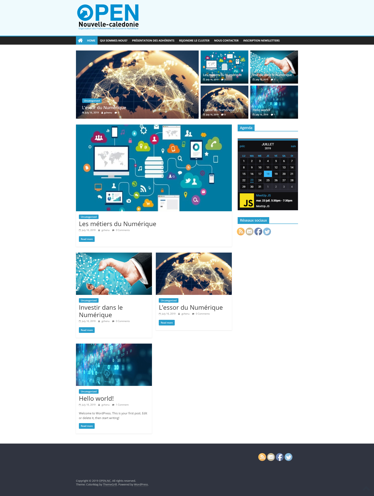
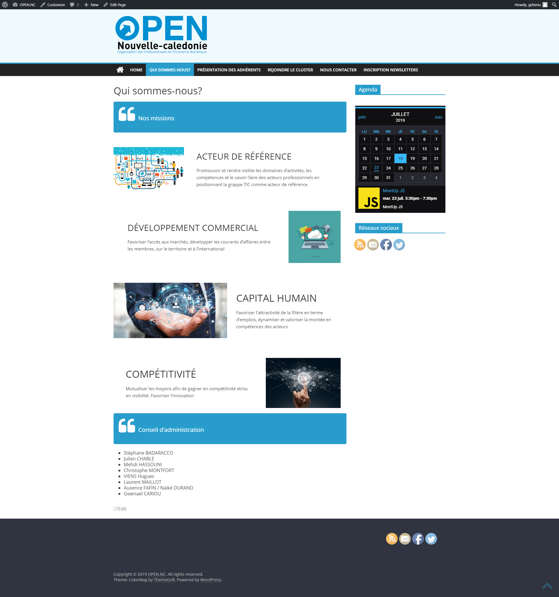
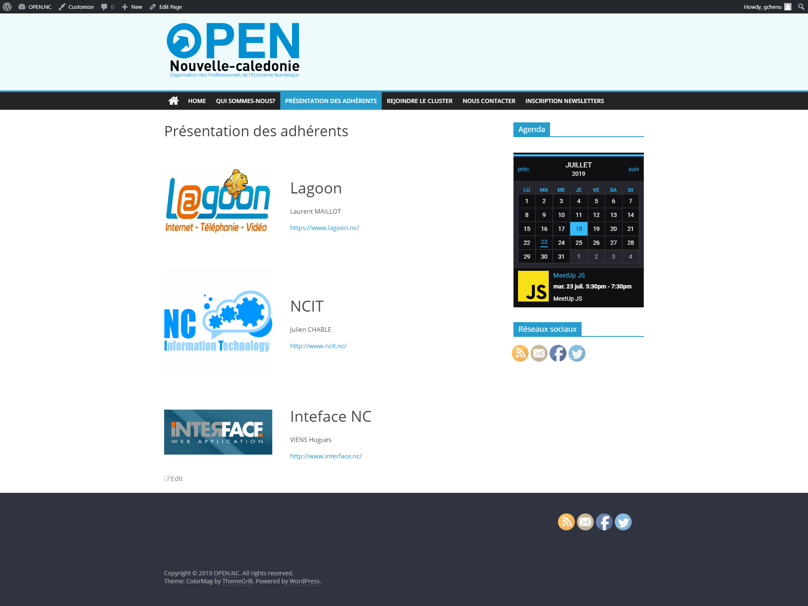
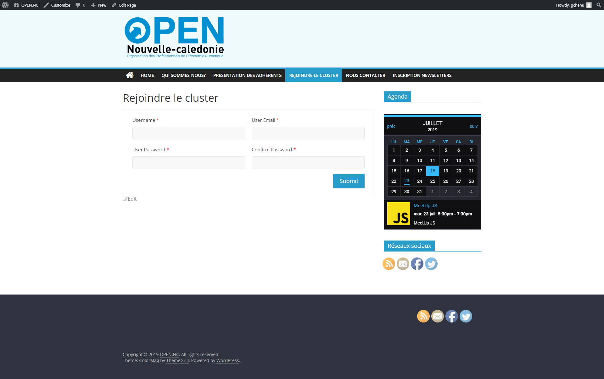
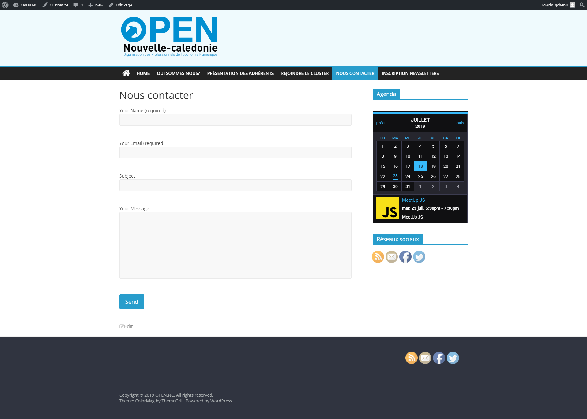
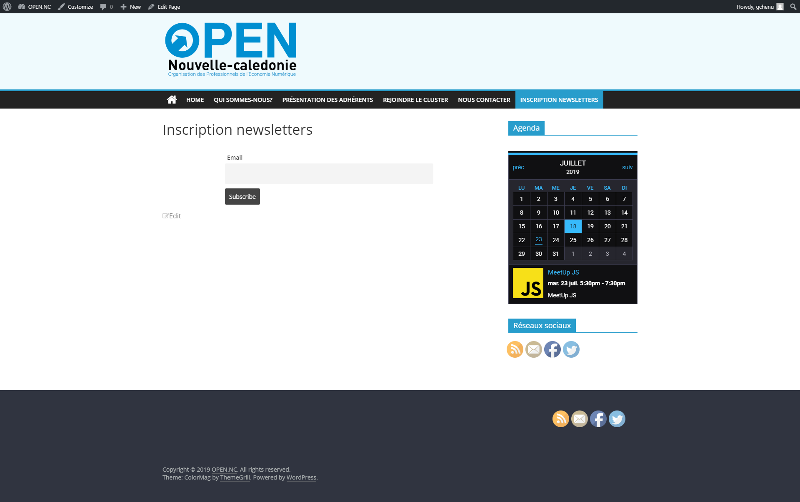

# Projet CMS OPEN NC

## Design global

### 1. Choix du design global
Le choix du design global du site OpenNC s'est basé sur les demandes du client fournis dans le cahier des charges. C'est-à-dire un design simple et épuré dans les tendances actuelles. Le choix s'est donc orienté vers un site "magazine" pour mettre en avant les actualités et événements d'OpenNC. Le tout conçu grâce au CMS Wordpress.

### 2. Plugins utilisés
- **Tockify Events Calendar** est un plugin d'agenda et de gestion d'évènements avec une interface utlisateur simple pour les futurs administrateur du site.
 - **Social Media Share** un plugin permettant d'intégrer vos réseaux sociaux préférés et ainsi de rester au plus près de l'actualité.
- **Contact Form 7** gère la création de formulaire.
- **Custom Permalink** permet la modification des url de base de wordpress.
- **Flamingo** gère les formulaires de contacts envoyé par les utilisateurs avec une interface simple.
- **Newsletters** permet la gestion des newsletters via une interface depuis le dashboard Wordpress.

### 3. CSS
Quelques modifications ont été apporté au fichier style.css du theme wordpress afin de coller au mieux avec la charte graphique du client. Notamment pour le choix des couleurs pour rester dans le même esprit que le log d'OpenNC.

## Pages du sites
### Homepage

Nous avons décidé d'afficher sur la page d'acceuil les derniers articles postés sous formes de tuiles en dessous du menu. Avec une partie caroussel pour faire défiler les 4 derniers articles et à gauche une partie pour afficher les articles les plus commentés.
Sur la sidebar de gauche on peut trouver notre calendrier et les moyens de contacts.

### Qui Sommes-nous?

Cette page affiche des **informations** concernant OpenNC, ses **missions** et **priorités**.

### Adhérents

Cette page affiche sous forme de liste des entreprises adhérentes à OpenNC. Avec les personnes à contacter, le logo de l'entreprise et un lien vers leur site web.

### Inscriptions

Cette page permet à ceux qui le souhaite, d'adhérer à OpenNC via un formulaire généré à l'aide du plugin **Contact Form 7**

### Nous Contacter

Cette page contient aussi un formulaire généré à l'aide du plugin **Contact Form 7** et le plugin **flamingo** envoi des alerte de notifications aux administrateur du site.

### Newsletters

Cette page permet à un utilisateur de s'inscrire aux newsletters afin de rester informer des dernières actualités d'OpenNC. Le plugin **Newletters**.
