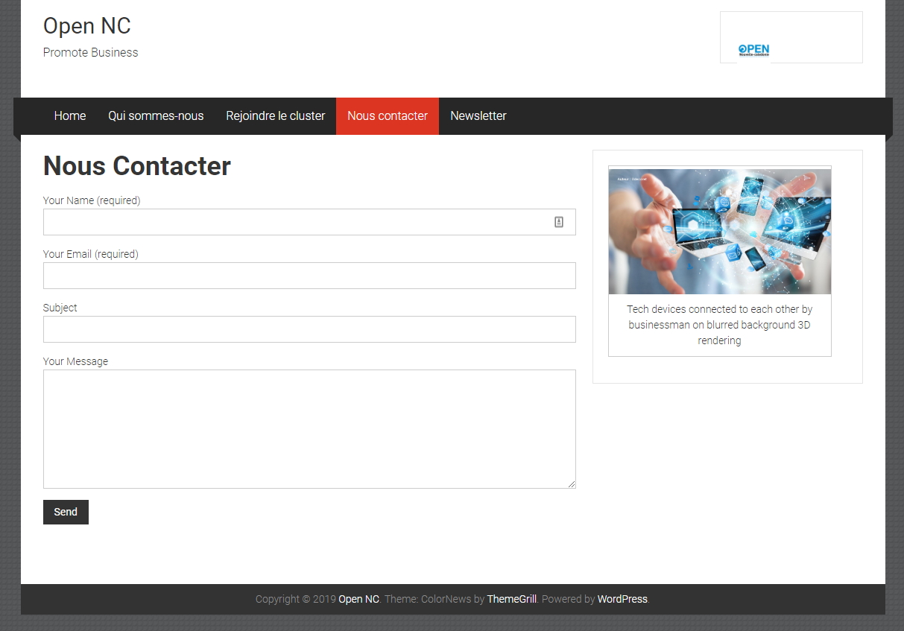

## CMS Wordpress

## Build the container in detached mode
```
docker-compose up -d
```

## Removes the containers and default network
```
docker-compose down
```

## Instructions
1. Créer un blog à l'aide du CMS Wordpress. Installer, sécuriser, internationaliser et structurer votre site.

2. Réaliser un thème sur mesure à partir des instructions suivantes.
  * Créer un nouveau dossier reflétant la structure suivante.
```
- my-project
 - docker-compose.yml
 - wp-content
  - themes
   - my-theme
    - index.php
    - style.css
```
  * Copier le fichier docker-compose.yml et ajouter le code suivant à l'application "wordpress".
```
volumes:
  - ./wp-content:/var/www/html/wp-content
```

**Note:** Le code doit être correctement indenté à l'aide de plugins. Le code doit être uniquement écrit en anglais.

-----------------------------------------------------------------------------

<center><strong>Offre de site</strong></center>

Afin de correspondre a vos attentes, j'ai prévu de faire un site qui sera diviser en plusieurs pages.
Ce template a était choisi du fait de sa faciliter d'utilisationet aussi il répond a beaucoup de critéres.

## Screenshots

1. Homepage


       Premièrement, on aura notre page d'accueil (Home) qui sera composé d'un menu principale à partir du quel on pourra accéder au autre page du site (Qui sommes-nous, Rejoindre le cluster, Nous Contacter et Newsletter).

       Au coeur de la page d'accueil, il y aura l'apparition des nouveaux arrivant sur  le cluster, les activités de chaque entreprises ainsi que leurs actualités(exemple: Nom: BlablaCar.nc, Activité: Entreprise de covoiturage en nouvelle calédonie, Actualité: Il viennent de sortir une application permettant au bateau de voler)

       J'ai choisi d'implémenter cette apparition afin qu'on soit contastement informer sur les entreprise naissantes et/ou l'actualité des entreprises en développement.

       Sur le côté droit on aura un calendrier des événement a venir. qui avec un bouton, déroulera une liste exhaustive des événement qui se dérouleront tardivement.
       Juste en dessous, l'apparition des derniers post facebook,Linkdin (ces posts apparaitront sur toutes les pages)
    

2. Qui sommes-nous?


       Ensuite, pour présenter un peu Open NC( les Mission et ambition, Offre et services, Bureau et conseil d’administration, Les partenaires) ces informations apparaitront dans un slider.


3. Rejoindre le cluster.


        Pour rejoindre le cluster, les utilisateur devront remplir un formulaire ou ils renseigneront leurs Nom, n°tel, email.

        Sur la partie droite, on affichera (en animation) les Témoignages des adhérents et Les métiers représentés.  

4. Nous contacter(formulaire)


        Un formulaire de contact pour permettre a l'utilisateur de poser des questions, demander des renseignement, etc...
5. Newsletter

 
       Inscription a la newsletter d'open NC via un formulaire