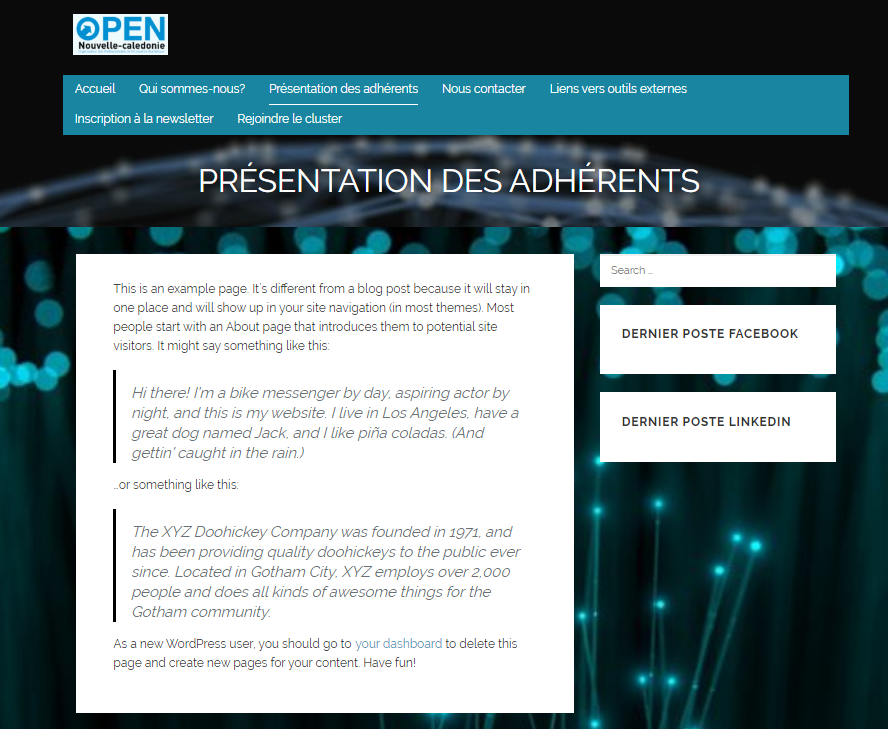

Séquence 5 Module 4
1. Je commence d'abord par chercher un template qui pourrait répondre au besoin du client.
J'ai choisi ce thème parce que je trouvais qu'il ressemblé selon moi au besoin exprimé par le client.Avec le visuel centrale (page d'accueil) et les éléments clés du cluster qui renvoie vers les rubriques du site (les pages).
2. J'installe le thème et je l'active.

3. Je créer les pages demandés par le clients.

Le site est terminé à 60% les pages :"présentation des adhérents"et "liens vers les outils externes" ne sont pas terminées.

 "Capture de la page d'accueil"

La page est réalisée directement dans le code avec des balises " div, h , p et img ,récupération de l'image sur internet.On y trouve l'origine de la création du cluster et la section actualité.Le menu nous ramène sur les différentes pages demandés par le client. Sur cette page la section dernier poste facebook et linkedin n'apparait pas,mais elle apparait su toutes les autres pages.

"Capture de la page qui sommes-nous"

Lien de la page dans le menu de la page d'accueil.Cette page contient les sections : missions et ambitions du cluster,les offres et services ,bureau et conseil d'administration et partenaires.Pour la présentation du bureau et du conseil d'administration , les données sont rentrées directement dans un tableau.

   "Capture de la page présentation des adhérents"

Lien de la page dans le menu de la page d'accueil.Page vide.

"Capture de la page nous contacter"

Lien de la page dans le menu de la page d'accueil.Page contenant l'adrèsse,mais pas terminée.

"Capture de la page lien vers les outils externes"

Lien de la page dans le menu de la page d'accueil. Page vide.

"Capture de la page inscription à la newsletter"

Lien de la page dans le menu de la page d'accueil. La page contient une section .Installation d'un plugin "WP Form" pou créer le formulaire d'inscription à la newsletter.

"Capture de la page rejoindre le cluster.PNG"

Lien de la page dans le menu de la page d'accueil. La page contient 3 sections :métiers représentés,Témoignages des adhérents,Rencontrons-nous.
Les métiers représentés sont rentrés dans une liste.
La section rencontrons nous contient un formulaire de candidature,le formulaire est réalisé grâce au plugin WP Form. Il contient 6 champs :nom,prénom,email,numéro de téléphone,ville, et votre candidature.Ainsi qu'une case à cocher pour le niveau du diplôme.

 