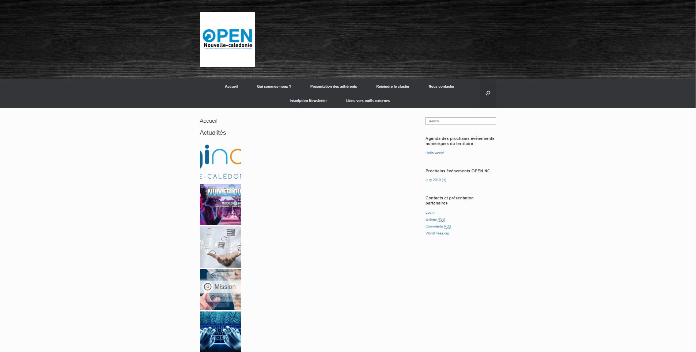
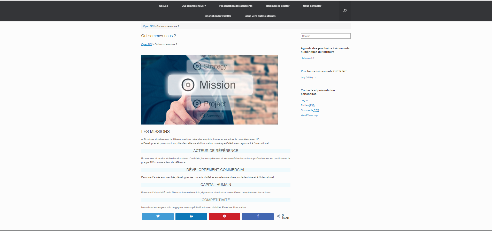
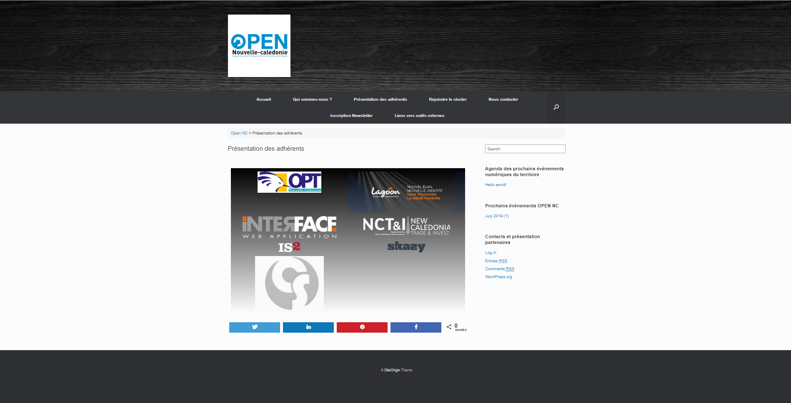
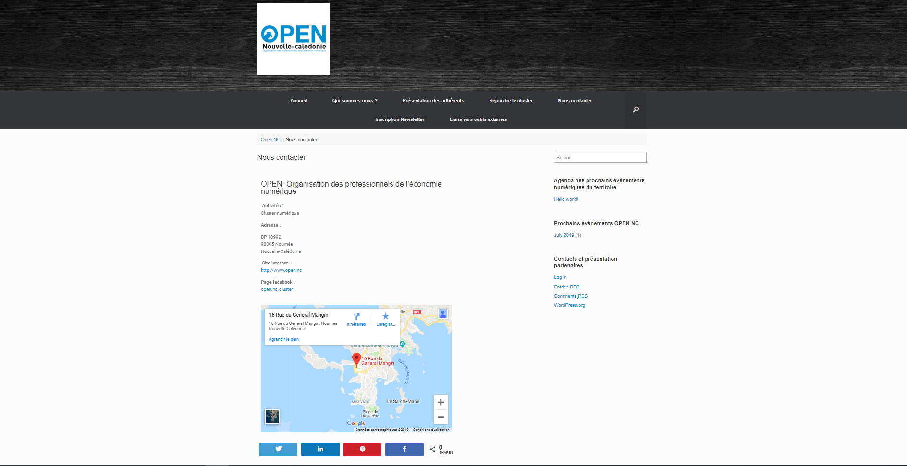
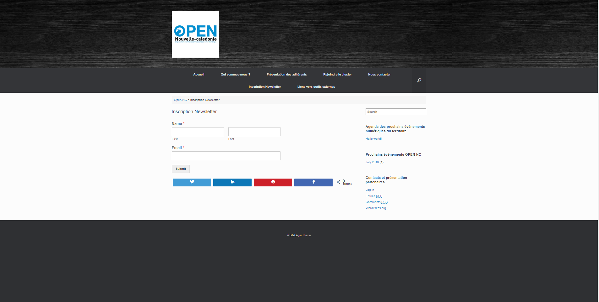
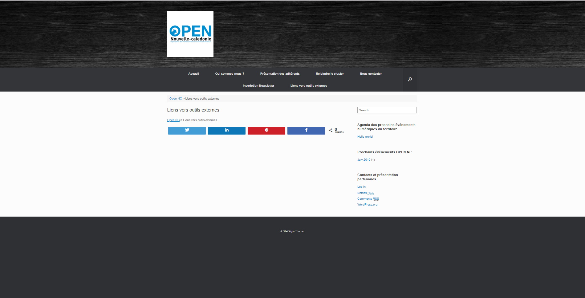

READ ME : Projet OPEN NC 

J'ai tout d'abord téléchargée mon template "Vantage", j'ai choisis ce template pour sa flexibilité. Son plus grand avantage est son intégration étroite à de puissants plugins, et aussi un support gratuit sur leur forum (http://siteorigin.com/thread/).

J'ai ensuite par rapport à mon template créée les pages demandées dans le CDC, et j'ai modifiée les permalinks.

Pour répondre aux différents besoins du client j'ai utilisée plusieurs plugins. Toutes mes pages sont éditées pour la plupart avec. Ci-dessous la liste des plugins, et la raison pour laquelle je les ai utilisées.

Plugins :

Pour éditer mes pages j'ai utilisée un plugin nommé "Elementor" qui est un plugin construteur de page. En effet j'ai choisis ce plugin car c'est une référence pour la conception de sites WordPress.
J'ai également téléchargée le plugin "TinyMCE Advanced" pour l'édition des pages (ajout de texte, possibilité de définir la famille et les tailles de police dans les blocs classic et l'éditeur classique..).

Pour le sécurité du site j'ai utilisée le plugin "Wordfence" qui est une sorte de couteau suisse puisqu'il permet de protéger le site contre les attaques les plus courantes (tentatives de connexion à l'administration du site etc) mais aussi de scanner les fichiers pour détécter des modifications suspectes.

J'ai utilisée le plugin "Breadcrumb NavXT" pour générer les piste de navigation dans le site afin que les utilisateurs puissent se retrouver.

Pour répondre à la demande client par rapport aux réseaux sociaux j'ai utilisée le plugin 'Social Warfare" qui ajoute de superbes boutons de partage social ultra-rapides.

Pour ajouter des formulaires j'ai utilisée le plugin "WP Forms", car celui-ci permet de créer de superbes formulaires de contacts, abonnements, paiement ..etc en quelques minutes.

J'ai utilisée le plugin 'redirection" pour la gestion de redirection et aussi pour aider à réduire les erreurs et à améliorer le classement du site.

 

Page d'accueil : j'ai ajoutée un carrossel avec des images pour la rubrique "Actualités" afin de voir les denières actualités. J'ai aussi modifiée le slider à droite avec les noms d'articles demandés qui apparait à droite de toutes les pages.

Page 'Qui sommes-nous?" : j'ai ajoutée une boîte d'image avec du texte.

Page 'Présentation des adhérents' : j'ai ajoutée une galerie d'images avec les logos des différents adhérents.

Page 'Rejoindre le Cluster' : je n'ai pas eu le temps de traiter cette page.

Page 'Nous contacter' : j'ai ajoutée l'adresse physique ainsi que le plan maps du cluster à l'aide du plug-in "Elementor".

Page 'Inscription Newsletter' : J'ai ajoutée le formulaire à l'aide du plugin "WP form".

 

Page 'Lien vers outils externes' : Je n'ai pas eu le temps de traiter cette page.

NB : J'ai aussi ajouter une page custom 'nous contacter' afin de pouvoir ajouter un élément avec le contact du manager comme demandé dans le CDC mais je n'ai pas pu finir. Je pense que je suis à 60% de mon projet CMS, et qu'il me faudrait un jour pour tout terminer. J'ai pu grâce aux fonctions réferences de WordPress comprendre les fonctions PHP dans le code, mais je n'ai pas pu le modifier car pas assez de temps, d'où l'utilisation des plugins.